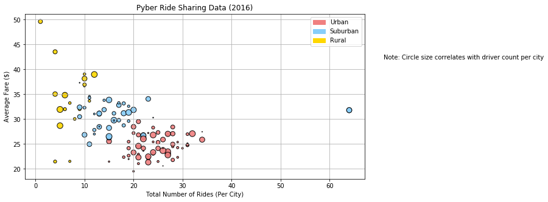
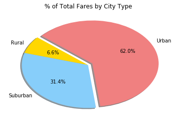
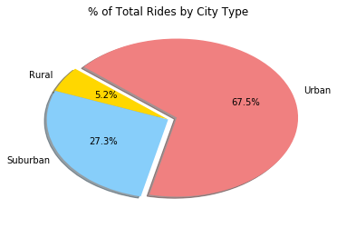
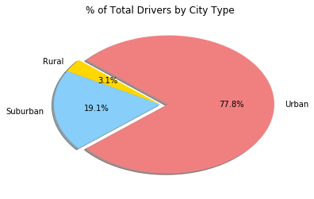

```python
#Pyber

#Obervation #1: The average fare is more expensive in rural areas.

#Obervation #2: There are more rides in urban areas.

#Obervation #3: Over 3/4 of the total drivers are in urban areas.
```


```python
import matplotlib.pyplot as plt
import matplotlib.patches as mpatches
import pandas as pd
import numpy as np
import os
```


```python
ride_data = os.path.join('raw_data', 'ride_data.csv')
city_data = os.path.join('raw_data', 'city_data.csv')

ride_data_df = pd.read_csv(ride_data)
city_data_df = pd.read_csv(city_data)
```


```python
pyber_df = pd.merge(ride_data_df, city_data_df,
                        how='outer', on='city')
```


```python
city = pyber_df.groupby('city')
avg_fare_per_city = city['fare'].mean()
```


```python
avg_fare_per_city2 = pd.concat([avg_fare_per_city], axis=1)
```


```python
total_rides_per_city = city['fare'].count()
```


```python
total_rides_per_city2=pd.concat([total_rides_per_city],axis=1)
total_rides_per_city2.columns=['total rides']
```


```python
driver_count_per_city = city_data_df[['city','driver_count']]
```


```python
driver_count_sorted = driver_count_per_city.sort_values('city', ascending=True)
driver_count_sorted_final = driver_count_sorted.set_index('city')
```


```python
driver_type_0 = city_data_df[['city','type']]
```


```python
driver_type_1 = driver_type_0.sort_values('city', ascending=True)
drive_type_final = driver_type_1.set_index('city')
```


```python
avg_fare_and_total_df = pd.concat([avg_fare_per_city2, total_rides_per_city2], axis=1)
avg_fare_and_total_df.columns=['avg fare','total rides']
```


```python
count_and_type = pd.concat([driver_count_sorted_final, drive_type_final], axis=1)
```


```python
together = count_and_type.join(avg_fare_and_total_df)
```


```python
together.columns=['Driver Count','Type','Avg Fare','Total Rides']
together.head()
```


<div>
<style>
    .dataframe thead tr:only-child th {
        text-align: right;
    }

    .dataframe thead th {
        text-align: left;
    }

    .dataframe tbody tr th {
        vertical-align: top;
    }
</style>
<table border="1" class="dataframe">
  <thead>
    <tr style="text-align: right;">
      <th></th>
      <th>Driver Count</th>
      <th>Type</th>
      <th>Avg Fare</th>
      <th>Total Rides</th>
    </tr>
    <tr>
      <th>city</th>
      <th></th>
      <th></th>
      <th></th>
      <th></th>
    </tr>
  </thead>
  <tbody>
    <tr>
      <th>Alvarezhaven</th>
      <td>21</td>
      <td>Urban</td>
      <td>23.928710</td>
      <td>31</td>
    </tr>
    <tr>
      <th>Alyssaberg</th>
      <td>67</td>
      <td>Urban</td>
      <td>20.609615</td>
      <td>26</td>
    </tr>
    <tr>
      <th>Anitamouth</th>
      <td>16</td>
      <td>Suburban</td>
      <td>37.315556</td>
      <td>9</td>
    </tr>
    <tr>
      <th>Antoniomouth</th>
      <td>21</td>
      <td>Urban</td>
      <td>23.625000</td>
      <td>22</td>
    </tr>
    <tr>
      <th>Aprilchester</th>
      <td>49</td>
      <td>Urban</td>
      <td>21.981579</td>
      <td>19</td>
    </tr>
  </tbody>
</table>
</div>


```python
x_limit = 100
x_values = np.arange(x_limit)
color_dict = { 'Urban':'#F08080', 'Suburban':'#87CEFA', 'Rural':'gold' }

together.plot(kind="scatter", x="Total Rides", y="Avg Fare", 
              color=[color_dict[i] for i in together['Type'] ], 
              grid=True, sizes=x_values, figsize=(10, 5), edgecolors="black",
              alpha=0.9, linewidth=1.05, title="Pyber Ride Sharing Data (2016)")

plt.xlabel("Total Number of Rides (Per City)")
plt.ylabel("Average Fare ($)")

urban = mpatches.Patch(color='#F08080', label='Urban')
suburban = mpatches.Patch(color='#87CEFA', label='Suburban')
rural = mpatches.Patch(color='gold', label='Rural')

plt.legend(handles=[urban, suburban, rural], loc="best")
```


    <matplotlib.legend.Legend at 0x134d0b9e8>


```python
#Show
plt.text(71,42,"Note: Circle size correlates with driver count per city")
plt.show()
```





```python
type_df = pyber_df.groupby('type')
type_per_city = type_df['fare'].sum()
```


```python
labels = ['Rural','Suburban','Urban']
colors = ['gold', '#87CEFA', '#F08080']
explode = [0, 0, 0.075]

plt.pie(type_per_city, labels=labels, colors=colors, explode=explode, 
        autopct="{0:1.1f}%".format, shadow=True, startangle=140)
```


    ([<matplotlib.patches.Wedge at 0x1a9480048>,
      <matplotlib.patches.Wedge at 0x1646e1ac8>,
      <matplotlib.patches.Wedge at 0x11bdbbdd8>],
     [Text(-0.969829,0.519068,'Rural'),
      Text(-0.839065,-0.711316,'Suburban'),
      Text(1.03314,0.559688,'Urban')],
     [Text(-0.528998,0.283128,'6.6%'),
      Text(-0.457672,-0.387991,'31.4%'),
      Text(0.593505,0.321523,'62.0%')])


```python
plt.title("% of Total Fares by City Type")
plt.show()
```





```python
type_df = pyber_df.groupby('type')
type_per_city2 = type_df['fare'].count()
```


```python
plt.pie(type_per_city2, labels=labels, colors=colors, explode=explode, 
        autopct="{0:1.1f}%".format, shadow=True, startangle=140)
```


    ([<matplotlib.patches.Wedge at 0x134b33198>,
      <matplotlib.patches.Wedge at 0x134b33be0>,
      <matplotlib.patches.Wedge at 0x134b416a0>],
     [Text(-0.946305,0.560809,'Rural'),
      Text(-0.972796,-0.513487,'Suburban'),
      Text(1.11441,0.372433,'Urban')],
     [Text(-0.516166,0.305896,'5.2%'),
      Text(-0.530616,-0.280084,'27.3%'),
      Text(0.640195,0.213951,'67.5%')])


```python
plt.title("% of Total Rides by City Type")
plt.show()
```





```python
type_driver_group = city_data_df.groupby('type')
type_driver_group_final = type_driver_group['driver_count'].sum()
```


```python
plt.pie(type_driver_group_final, labels=labels, colors=colors, explode=explode, 
        autopct="{0:1.1f}%".format, shadow=True, startangle=140)
```


    ([<matplotlib.patches.Wedge at 0x1347dd7f0>,
      <matplotlib.patches.Wedge at 0x1347e5278>,
      <matplotlib.patches.Wedge at 0x1347e5cf8>],
     [Text(-0.907513,0.621626,'Rural'),
      Text(-1.09499,-0.104863,'Suburban'),
      Text(1.175,-0.00244948,'Urban')],
     [Text(-0.495007,0.339069,'3.1%'),
      Text(-0.597267,-0.0571977,'19.1%'),
      Text(0.674999,-0.00140715,'77.8%')])


```python
plt.title("% of Total Drivers by City Type")
plt.show()
```




